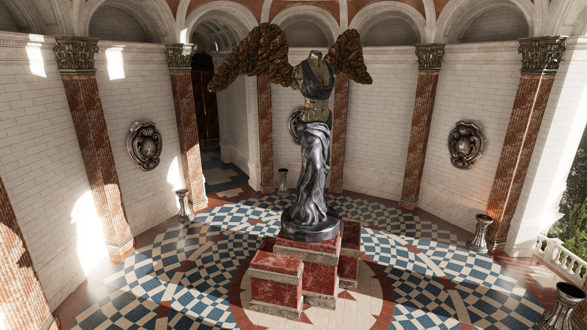
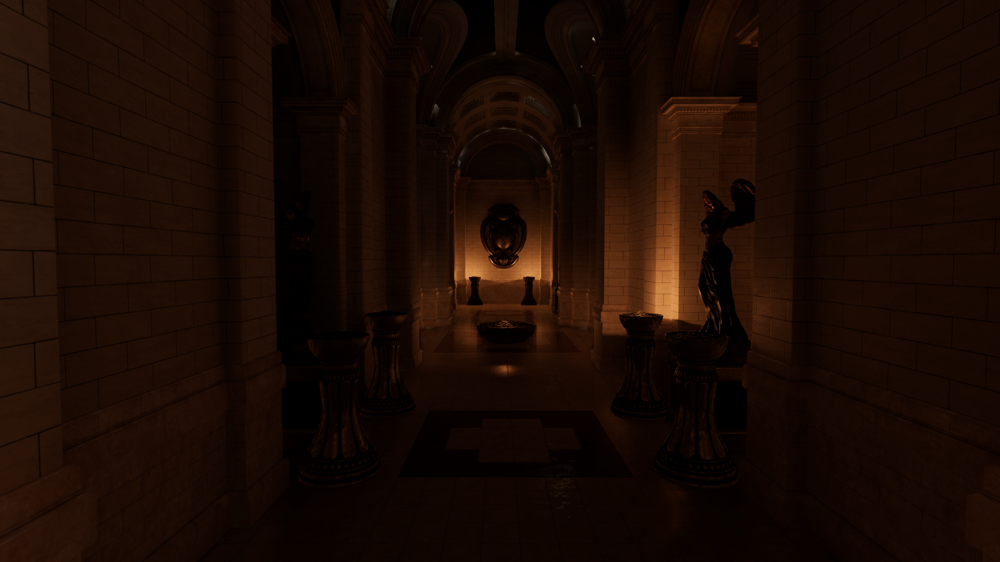

# Godot-Sun-Temple-Tweaked
Unreal Engine's Sun Temple demo for Godot, tweaked. Original can be found [here](https://github.com/godotengine/godot/issues/75440).

## Tweaks:
1. Added anisotropic filtering.
2. Added volumetric fog with a height falloff approach.
3. Replaced SSAO with SSIL.
4. Configured glow for the Screen Blend Mode.
5. Added shadows to torch lights.